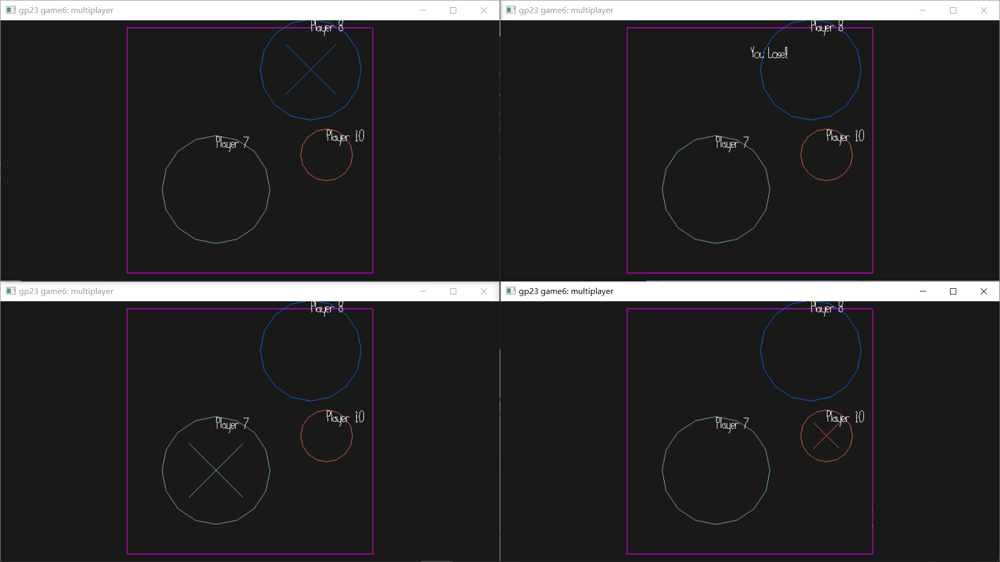

# Multi Baller

Author: Haoxi Zhang

Design: Player need to kick other balls out of bound and ball will become bigger. 

Networking: The message is the radius, position and velocity of each player. Using a modification version of `send_state_message` inside `Game.cpp`

Screen Shot:

How To Play:

WASD to move your circle.

Sources:

This game was built with [NEST](NEST.md).
